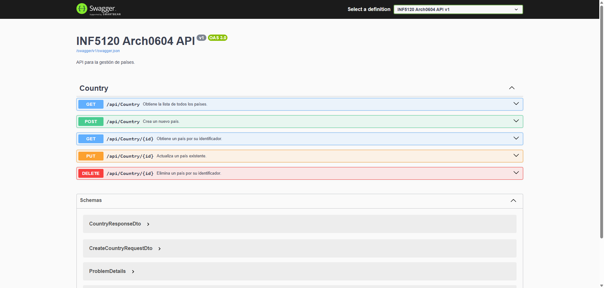
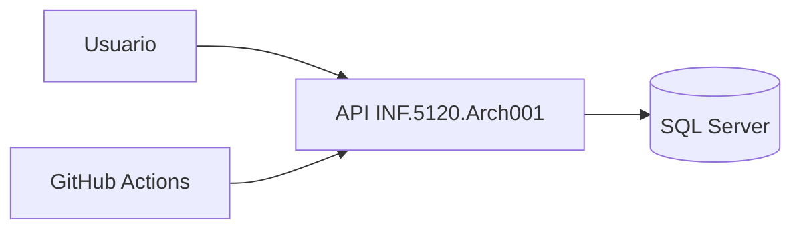
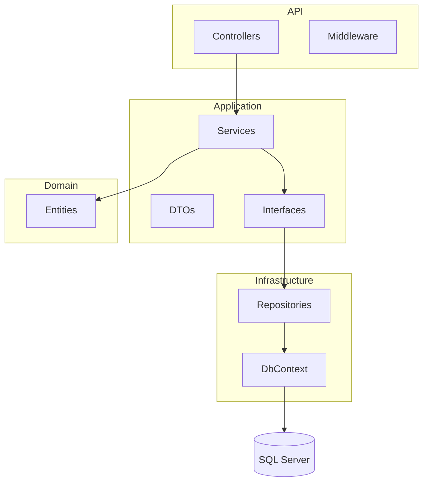

# 🌍 INF.5120.Arch001 API

[]()
[]()
[]()
[]()
[](https://github.com/edjnolasco/inf-arch-001/actions/workflows/ci.yml)
[](https://codecov.io/gh/edjnolasco/inf-arch-001)

API REST desarrollada en ASP.NET Core aplicando Clean Architecture, con separación de responsabilidades, pruebas automatizadas y pipeline CI con cobertura.

---

## 📌 Descripción

El proyecto implementa un CRUD de países utilizando ASP.NET Core y Entity Framework Core, siguiendo principios de Clean Architecture para garantizar mantenibilidad, escalabilidad y testabilidad.

---

## Swagger UI



---

## 🧩 Arquitectura (C4 Model)

### 🔹 Context Diagram


🔹 Container Diagram


---
🔹 Regla de dependencias

Domain ← Application ← Infrastructure ← API
---

📁 Estructura del proyecto

```text
INF.5120.Arch001/
├── INF.5120.Arch001.sln
├── src/
│   ├── INF.5120.Arch001.Api/
│   ├── INF.5120.Arch001.Application/
│   ├── INF.5120.Arch001.Domain/
│   └── INF.5120.Arch001.Infrastructure/
├── tests/
│   ├── INF.5120.Arch001.Api.Tests/
│   ├── INF.5120.Arch001.Application.Tests/
│   ├── INF.5120.Arch001.Domain.Tests/
│   └── INF.5120.Arch001.Infrastructure.Tests/
└── .github/workflows/

```
## 📘 Architecture Decision Records (ADR)

Las decisiones clave del sistema están documentadas en:

- [ADR-001: Clean Architecture](decisions/001-clean-architecture.md)
- [ADR-002: EF Core](decisions/002-ef-core.md)
- [ADR-003: ServiceResult](decisions/003-serviceresult.md)
- [ADR-004: Docker](decisions/004-docker.md)
- [ADR-005: Testing Strategy](decisions/005-testing.md)
- [ADR-006: Logging Strategy](decisions/006-logging.md)
---

⚙️ Tecnologías
.NET 8
ASP.NET Core
Entity Framework Core
SQL Server
Swagger / OpenAPI
xUnit
EF Core InMemory
GitHub Actions
Codecov
Docker

---

📦 Funcionalidades

```text
GET    /api/Country
GET    /api/Country/{id}
POST   /api/Country
PUT    /api/Country/{id}
DELETE /api/Country/{id}

```
---

🧠 Manejo de errores

Uso de ServiceResult<T> y ServiceErrorType.

Ejemplo:

```json
{
  "success": false,
  "errorType": "NotFound",
  "message": "El recurso solicitado no existe."
}

```

📝 Logging

Se utiliza ILogger<T> para registrar:

operaciones CRUD
validaciones
conflictos
errores

---

🧪 Pruebas

Incluye:

Unit tests (Application)
Integration tests (EF Core InMemory)

---

📊 Coverage con Codecov

Ejecutar localmente:

```bash
dotnet test INF.5120.Arch001/INF.5120.Arch001.sln --collect:"XPlat Code Coverage"
```

Configurar en GitHub:

Ir a Settings → Secrets → Actions
Agregar:

```bash
CODECOV_TOKEN
```
---

🚀 CI/CD

Pipeline incluye:

restore
build
test
coverage

Archivo:

```text
.github/workflows/ci.yml
```
---

🐳 Docker
Build

```bash
docker build -t inf-arch001-api .

```
Run

```bash
docker run -p 8080:8080 inf-arch001-api
```
---

🐳 Docker Compose (SQL Server + API)

Archivo: docker-compose.yml

Ejecutar:

```bash
docker compose up -d --build

```
Swagger:

```text
http://localhost:8080/swagger

```
---
🔍 Swagger

Disponible en:

```text
https://localhost:{puerto}/swagger
```
---

▶️ Ejecución local

```bash
dotnet restore
dotnet build
dotnet run

```
---
📌 Estado

✔ Clean Architecture
✔ CRUD
✔ Swagger
✔ Logging
✔ Tests
✔ CI
✔ Coverage
✔ Docker
---

📚 Autor
Edwin José Nolasco
INF-5120
---
