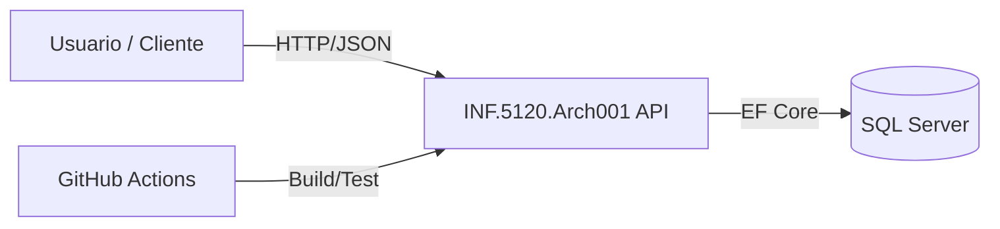
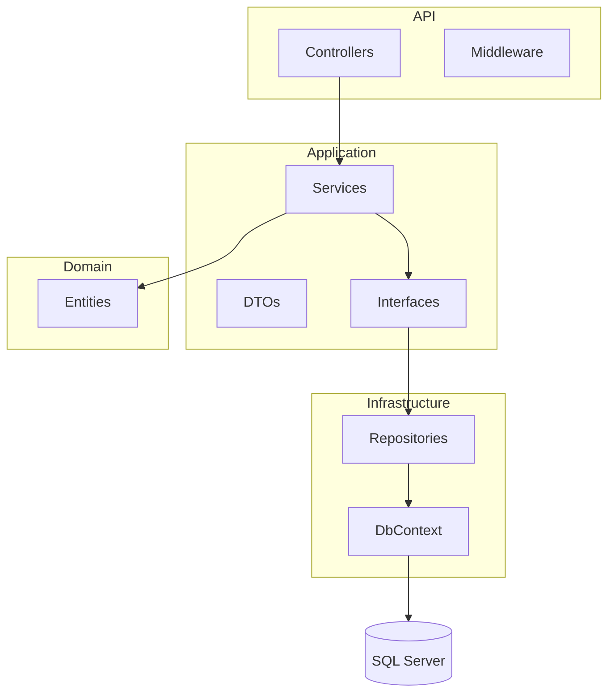
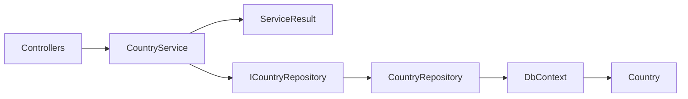
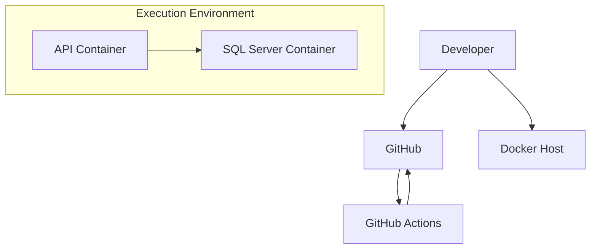
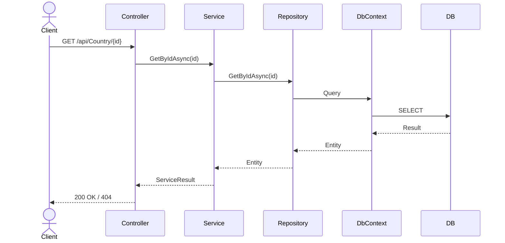
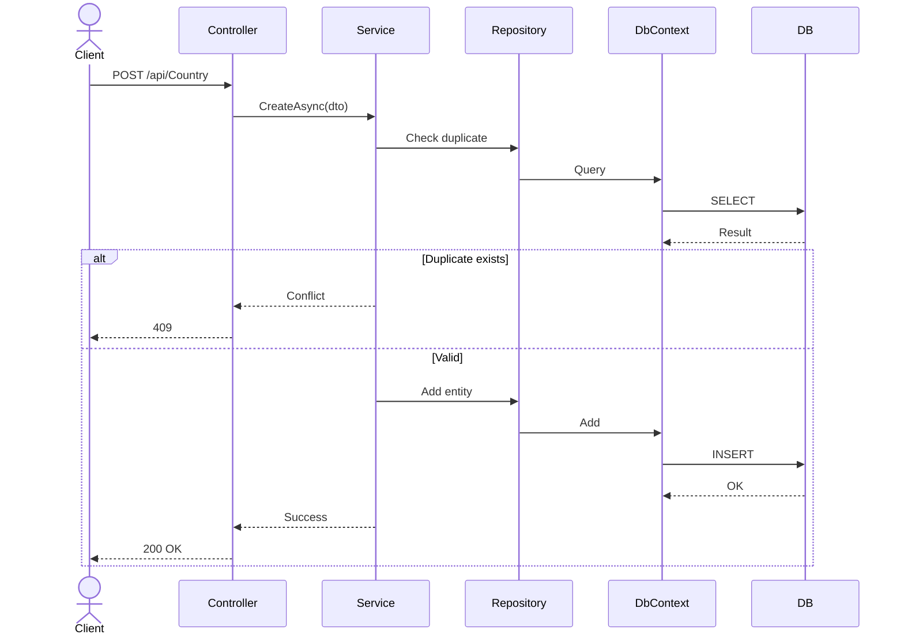

# 🧩 Arquitectura del sistema — INF.5120.Arch001

## 1. Propósito

Este documento describe la arquitectura de la API **INF.5120.Arch001**, incluyendo estructura, decisiones de diseño, flujo de ejecución y criterios técnicos adoptados.

El objetivo es garantizar:

- Bajo acoplamiento
- Alta cohesión
- Testabilidad
- Escalabilidad progresiva
- Mantenibilidad

---

## 2. Enfoque arquitectónico

Se adopta **Clean Architecture**, orientada a separar responsabilidades y controlar dependencias entre capas.

### Principio fundamental

> Las dependencias siempre apuntan hacia el dominio.

---

## 3. Vista arquitectónica (C4 Model)

---

### 3.1 Context Diagram



3.2 Container Diagram


3.3 Component Diagram


3.4 Deployment Diagram



3.5 Sequence Diagram — GET Country



3.6 Sequence Diagram — CREATE Country


4. Capas del sistema
4.1 Domain

Contiene:

Entidades
Reglas de negocio

Características:

No depende de ninguna capa
No conoce infraestructura
4.2 Application

Contiene:

Servicios (CountryService)
Interfaces (ICountryRepository)
DTOs
ServiceResult<T>

Responsabilidad:

Orquestar casos de uso
Validar reglas
Controlar flujo
4.3 Infrastructure

Contiene:

Repositorios
DbContext (EF Core)

Responsabilidad:

Persistencia
Acceso a datos
4.4 API

Contiene:

Controllers
Swagger
Pipeline HTTP

Responsabilidad:

Exposición REST
Adaptación request/response
5. Regla de dependencias

```text
Domain ← Application ← Infrastructure ← API
```
6. Flujo de ejecución
```text
Controller → Service → Repository → DbContext → Database
```

7. Manejo de errores

Se implementa:

ServiceResult<T>
ServiceErrorType

Ventajas:

Consistencia
Control del flujo
Evita excepciones innecesarias

8. Logging

Uso de ILogger<T> para:

auditoría
errores
trazabilidad

9. Testing
Unit tests
Application
Servicios
Integration tests
EF Core InMemory
Repositorios
10. Decisiones arquitectónicas
Clean Architecture

✔ Separación de responsabilidades
✔ Facilita testing
✔ Escalable

EF Core

✔ Productividad
✔ Integración nativa

ServiceResult

✔ Manejo consistente de errores
✔ Evita excepciones como flujo

DTOs

✔ Control del contrato
✔ Evita exponer dominio

11. Trade-offs
Decisión	Beneficio	Costo
Clean Architecture	Bajo acoplamiento	Mayor complejidad
ServiceResult	Control de errores	Más código
EF Core	Productividad	Abstracción
DTOs	Seguridad	Mapeo
12. Escalabilidad

Permite:

Agregar módulos
Cambiar infraestructura
Migrar a microservicios
13. Evolución futura
Middleware global de excepciones
Versionado de API
Health checks
OpenTelemetry
CQRS / MediatR

14. Conclusión

La arquitectura implementada proporciona una base sólida, mantenible y extensible, adecuada para evolución hacia escenarios productivos y entornos empresariales.
